# Documentação das Alterações do Modelo

## 1. Introdução

Este documento descreve as alterações realizadas no modelo de classes em relação à primeira versão. O objetivo das modificações foi incorporar funcionalidades de cadastro, consulta, validação e persistência de dados, tornando o modelo mais aderente às regras de negócio definidas para o sistema de monitoria.

---

# 2. Atualização do Diagrama de Classes

O diagrama de classes foi revisado para representar não apenas a estrutura das entidades do domínio, mas também seus comportamentos e responsabilidades.

A estrutura principal do sistema foi mantida, preservando a hierarquia de usuários e as entidades relacionadas à monitoria. Entretanto, foram adicionadas operações, restrições e responsabilidades que refletem funcionalidades efetivamente implementadas no sistema.

---

# 3. Alterações na Hierarquia de Usuários

## Estrutura Mantida

A hierarquia de herança permaneceu organizada da seguinte forma:

```text
Usuario
├── Discente
│   └── Monitor
└── Docente
```

A utilização de herança continua permitindo o compartilhamento dos atributos comuns entre os diferentes perfis do sistema.

---

## Classe Usuario

### Situação Anterior

Possuía apenas atributos básicos comuns a todos os usuários.

### Situação Atual

Foram adicionadas operações responsáveis pelo gerenciamento de usuários:

* cadastrar_usuario()
* listar_usuarios()
* buscar_usuario()

### Regras adicionadas

* Nome obrigatório.
* E-mail obrigatório.
* Senha obrigatória.
* Usuário ativo por padrão.
* E-mail único no sistema.

### Justificativa

Centralizar funcionalidades relacionadas à gestão de usuários e explicitar regras de negócio essenciais.

---

## Classe Discente

### Alterações

* Inclusão da operação de cadastro.
* Validação obrigatória de matrícula.
* Restrição de cadastro utilizando apenas e-mails do domínio:

```text
@discente.ufpb.br
```

### Justificativa

Garantir que apenas alunos vinculados à instituição possam acessar o sistema.

---

## Classe Docente

### Alterações

* Inclusão da operação de cadastro.
* Validação dos domínios institucionais:

```text
@ufpb.br
@ci.ufpb.br
```

### Justificativa

Restringir o acesso aos docentes vinculados à instituição.

---

## Classe Monitor

### Situação Anterior

Representava apenas uma especialização de Discente.

### Situação Atual

Foram adicionadas operações específicas para gerenciamento da monitoria:

* promover_usuario()
* revogar_monitor()

### Regras adicionadas

* Apenas discentes podem ser promovidos.
* Disciplina vinculada obrigatória.
* Disponibilidade inicial definida como verdadeira.
* Controle de carga horária.

### Justificativa

Representar explicitamente o ciclo de vida de um monitor dentro do sistema.

---

# 4. Alterações na Classe Disciplina

## Situação Anterior

A classe possuía apenas atributos descritivos.

## Situação Atual

Foram adicionadas operações para gerenciamento das disciplinas:

* cadastrar_disciplina()
* listar_disciplinas()

### Regras adicionadas

* Código obrigatório.
* Nome obrigatório.
* Ementa obrigatória.
* Código único.
* Conversão automática do código para letras maiúsculas.

### Justificativa

Garantir consistência dos dados e evitar duplicidade de disciplinas.

---

# 5. Revisão dos Relacionamentos

Os relacionamentos existentes foram mantidos e refinados para refletir melhor as responsabilidades das entidades.

## Principais associações

### Discente ↔ DisciplinaFavorita

Permite que um aluno registre disciplinas de interesse.

### Discente ↔ DemonstracaoInteresse

Representa o interesse de um aluno em participar de sessões de monitoria.

### Monitor ↔ SessaoMonitoria

Relaciona monitores às sessões realizadas.

### SessaoMonitoria ↔ Inscricao

Representa os alunos inscritos em uma sessão.

### SessaoMonitoria ↔ RegistroPresenca

Permite registrar presença dos participantes.

### Disciplina ↔ MaterialDidatico

Representa os materiais disponibilizados para determinada disciplina.

### Disciplina ↔ Chat

Permite comunicação entre os participantes da disciplina.

### Chat ↔ Mensagem

Representa as mensagens trocadas dentro de um chat.

---

# 6. Inclusão de Regras de Negócio no Modelo

Uma das principais evoluções do modelo foi a incorporação explícita de regras de negócio.

## Regras de Usuário

### Validação de E-mail Institucional

Discente:

```text
@discente.ufpb.br
```

Docente:

```text
@ufpb.br
@ci.ufpb.br
```

### Validação de E-mail Único

Não é permitido o cadastro de usuários com e-mails já existentes.

### Política de Senha

A senha deve:

* possuir entre 8 e 100 caracteres;
* conter pelo menos uma letra maiúscula;
* conter pelo menos um número.

---

## Regras de Disciplina

* Código único.
* Campos obrigatórios preenchidos.
* Padronização do código em letras maiúsculas.

---

## Regras de Monitoria

* Apenas discentes podem ser promovidos a monitor.
* Monitores devem possuir disciplina vinculada.
* Monitores podem retornar ao perfil de discente.

---

# 7. Alterações Arquiteturais

Além da atualização do modelo de domínio, foi introduzida uma arquitetura em camadas para separar responsabilidades.

## Camada de Modelo (Model)

Responsável pela representação das entidades do domínio:

* Usuario
* Discente
* Monitor
* Docente
* Disciplina
* SessaoMonitoria
* Inscricao
* entre outras.

## Camada de Serviço (Service)

Responsável pelas regras de negócio:

### UsuarioService

* cadastro de usuários;
* consultas;
* paginação;
* promoção de monitores;
* revogação de monitoria.

### DisciplinaService

* cadastro de disciplinas;
* listagem de disciplinas;
* validações de negócio.

## Camada de Persistência (Repository)

Responsável pelo armazenamento e recuperação dos dados.

### UsuarioRepository

* salvar usuários;
* atualizar usuários;
* buscar usuários;
* paginação e filtros.

### DisciplinaRepository

* salvar disciplinas;
* buscar disciplinas;
* listar disciplinas.

---

# 8. Conclusão

O modelo evoluiu significativamente em relação à versão anterior. Além da manutenção da estrutura principal do domínio, foram adicionadas operações, validações e responsabilidades que refletem funcionalidades efetivamente implementadas no sistema.

As alterações realizadas tornaram o modelo mais consistente, aproximando-o da implementação real da aplicação e estabelecendo uma base sólida para futuras funcionalidades relacionadas à monitoria acadêmica.

---

# 9. Identificação de Padrões de Projeto (Design Patterns)

O backend do sistema **Monitorando** utiliza diversos padrões de projeto (padrões do GoF e padrões arquiteturais) que garantem a flexibilidade, testabilidade e separação de responsabilidades (SOLID). A seguir, descrevemos os padrões identificados:

### 1. Facade (Fachada)
- **Implementação**: [FacadeSingletonController](file:///c:/Users/Dell/OneDrive/Documentos/Gabriel/UFPB/CS%20-%20P6%20-%202026.1/Software%20Projects%20Methods/Monitorando/backend/app/controllers/facade_singleton_controller.py)
- **Objetivo**: Fornecer uma interface simplificada e unificada para o conjunto de serviços do sistema (`UsuarioService`, `DisciplinaService` e `InscricaoMonitoriaService`).
- **Benefício**: Os roteadores/endpoints da API (`facade_router.py`) não precisam conhecer a complexidade individual de cada serviço ou como inicializá-los; eles apenas interagem com a fachada.

### 2. Singleton
- **Implementação**: Instância `facade_singleton_controller` exportada em [facade_singleton_controller.py](file:///c:/Users/Dell/OneDrive/Documentos/Gabriel/UFPB/CS%20-%20P6%20-%202026.1/Software%20Projects%20Methods/Monitorando/backend/app/controllers/facade_singleton_controller.py)
- **Objetivo**: Garantir que a classe `FacadeSingletonController` possua apenas uma única instância em todo o ciclo de vida da aplicação.
- **Benefício**: Evita a instanciação redundante de controladores de alto nível e mantém o controle de injeção centralizado de forma única no boot da aplicação.

### 3. Repository (Repositório)
- **Implementação**: Interfaces abstratas (ex: `AbstractUsuarioRepository`) e suas implementações concretas (ex: `SQLiteUsuarioRepository` e `InMemoryUsuarioRepository`) na pasta `app/repositories/`.
- **Objetivo**: Encapsular a lógica de persistência de dados. A camada de domínio (Services) não sabe se os dados estão armazenados em memória (RAM) ou em banco de dados relacional (SQLite/SQLAlchemy).
- **Benefício**: Desacoplamento absoluto do mecanismo de persistência, facilitando a portabilidade do banco de dados e a escrita de testes unitários isolados.

### 4. Simple Factory (Fábrica Simples)
- **Implementação**: Funções do módulo [factory.py](file:///c:/Users/Dell/OneDrive/Documentos/Gabriel/UFPB/CS%20-%20P6%20-%202026.1/Software%20Projects%20Methods/Monitorando/backend/app/repositories/factory.py) (`make_usuario_repository`, `make_disciplina_repository`, `make_inscricao_monitoria_repository`)
- **Objetivo**: Encapsular e centralizar a criação dos repositórios correspondentes.
- **Benefício**: A escolha entre banco de dados SQLite ou armazenamento em RAM é feita de forma transparente pela fábrica baseando-se na variável de ambiente `REPO_BACKEND`.

### 5. Injeção de Dependências & Princípio da Inversão de Dependência (DIP)
- **Implementação**: Injeção via construtores nos serviços (ex: `UsuarioService(repo=usuario_repo)`) realizada no boot do aplicativo (`main.py` lifespan).
- **Objetivo**: Fazer com que módulos de alto nível (Services) dependam de abstrações (Interfaces dos Repositórios) e não de implementações de baixo nível (SQLite/RAM).
- **Benefício**: Testabilidade extrema e acoplamento fraco entre as camadas.

---

# 10. Diagrama de Classes Atualizado (Sintaxe Mermaid)

O diagrama abaixo apresenta o modelo de classes do backend do **Monitorando**, estruturando a persistência, os serviços, o controlador geral (Facade/Singleton) e as entidades do domínio, com destaque para a aplicação dos padrões de projeto:

```mermaid
classDiagram
    direction TB

    %% Controllers / Fachadas
    class FacadeSingletonController {
        <<Singleton>>
        <<Facade>>
        -_instance : FacadeSingletonController
        +usuario_service : UsuarioService
        +disciplina_service : DisciplinaService
        +inscricao_monitoria_service : InscricaoMonitoriaService
        +initialize(usuario_svc, disciplina_svc, inscricao_svc) void
        +quantidade_entidades_cadastradas() int
    }

    %% Serviços (Camada de Controle)
    class UsuarioService {
        -_repo : AbstractUsuarioRepository
        +cadastrar_usuario(cadastro) Union[Discente, Docente]
        +listar_usuarios(pagina, limite) PaginatedUsuarios
        +buscar_usuario_por_id(id) Union[Discente, Docente, Monitor]
        +promover_usuario(id, request) Monitor
        +revogar_monitor(id) Discente
        +login_usuario(login, senha) Union[Discente, Docente, Monitor]
    }

    class DisciplinaService {
        -_repo : AbstractDisciplinaRepository
        +cadastrar_disciplina(cadastro) Disciplina
        +listar_disciplinas() List[DisciplinaResponse]
    }

    class InscricaoMonitoriaService {
        -_inscricao_repo : AbstractInscricaoMonitoriaRepository
        -_usuario_repo : AbstractUsuarioRepository
        -_disciplina_repo : AbstractDisciplinaRepository
        +cadastrar_inscricao(cadastro) InscricaoMonitoria
        +listar_inscricoes() List[InscricaoMonitoriaResponse]
        +buscar_inscricao_por_id(id) InscricaoMonitoria
        +atualizar_inscricao(id, atualizacao) InscricaoMonitoria
        +remover_inscricao(id) void
        +contar_inscricoes() int
    }

    %% Abstrações de Persistência (Padrão Repository)
    class AbstractUsuarioRepository {
        <<Interface>>
        +add(usuario) void
        +update(usuario) void
        +delete(id) bool
        +find_by_id(id) Union[Discente, Docente, Monitor]
        +find_by_login(login) Union[Discente, Docente, Monitor]
        +find_all() List[Union[Discente, Docente, Monitor]]
    }

    class AbstractDisciplinaRepository {
        <<Interface>>
        +add(disciplina) void
        +update(disciplina) void
        +delete(id) bool
        +find_by_id(id) Disciplina
        +find_by_codigo(codigo) Disciplina
        +find_all() List[Disciplina]
    }

    class AbstractInscricaoMonitoriaRepository {
        <<Interface>>
        +add(inscricao) void
        +update(inscricao) void
        +delete(id) bool
        +find_by_id(id) InscricaoMonitoria
        +find_all() List[InscricaoMonitoria]
        +count() int
    }

    %% Repositories Fábrica (Padrão Simple Factory)
    class RepositoryFactory {
        <<Factory>>
        +make_usuario_repository() AbstractUsuarioRepository
        +make_disciplina_repository() AbstractDisciplinaRepository
        +make_inscricao_monitoria_repository() AbstractInscricaoMonitoriaRepository
    }

    %% Implementações SQLite (Persistência Física)
    class SQLiteUsuarioRepository {
        +add(usuario) void
        +update(usuario) void
        ...
    }
    class SQLiteDisciplinaRepository {
        +add(disciplina) void
        +update(disciplina) void
        ...
    }
    class SQLiteInscricaoMonitoriaRepository {
        +add(inscricao) void
        +update(inscricao) void
        ...
    }

    %% Implementações em RAM (Persistência Ephemeral)
    class InMemoryUsuarioRepository {
        +add(usuario) void
        +update(usuario) void
        ...
    }
    class InMemoryDisciplinaRepository {
        +add(disciplina) void
        +update(disciplina) void
        ...
    }
    class InMemoryInscricaoMonitoriaRepository {
        +add(inscricao) void
        +update(inscricao) void
        ...
    }

    %% Entidades do Domínio (Entity)
    class Usuario {
        <<abstract>>
        +id : UUID
        +nome : String
        +login : String
        +email : String
        +senha : String
        +perfil : TipoPerfil
        +ativo : Boolean
    }
    class Discente {
        +matricula : String
        +curso : String
        +periodo : Integer
        +disciplinasInteresse : List[String]
    }
    class Docente {
        +siape : String
        +departamento : String
        +isCoordenador : Boolean
        +disciplinas : List[String]
    }
    class Monitor {
        +cargaHoraria : Integer
        +disponivel : Boolean
        +disciplinaVinculada : String
    }
    class Disciplina {
        +id : UUID
        +codigo : String
        +nome : String
        +ementa : String
        +periodo : Integer
    }
    class InscricaoMonitoria {
        +id : UUID
        +usuario_id : UUID
        +disciplina_id : UUID
        +motivacao : String
        +status : StatusInscricao
    }

    %% Associações e Relacionamentos
    FacadeSingletonController --> UsuarioService : utiliza
    FacadeSingletonController --> DisciplinaService : utiliza
    FacadeSingletonController --> InscricaoMonitoriaService : utiliza

    UsuarioService ..> AbstractUsuarioRepository : depende de (DIP)
    DisciplinaService ..> AbstractDisciplinaRepository : depende de (DIP)
    InscricaoMonitoriaService ..> AbstractInscricaoMonitoriaRepository : depende de (DIP)
    InscricaoMonitoriaService ..> AbstractUsuarioRepository : depende de (DIP)
    InscricaoMonitoriaService ..> AbstractDisciplinaRepository : depende de (DIP)

    AbstractUsuarioRepository <|-- SQLiteUsuarioRepository : implementa
    AbstractUsuarioRepository <|-- InMemoryUsuarioRepository : implementa
    AbstractDisciplinaRepository <|-- SQLiteDisciplinaRepository : implementa
    AbstractDisciplinaRepository <|-- InMemoryDisciplinaRepository : implementa
    AbstractInscricaoMonitoriaRepository <|-- SQLiteInscricaoMonitoriaRepository : implementa
    AbstractInscricaoMonitoriaRepository <|-- InMemoryInscricaoMonitoriaRepository : implementa

    RepositoryFactory ..> AbstractUsuarioRepository : fabrica
    RepositoryFactory ..> AbstractDisciplinaRepository : fabrica
    RepositoryFactory ..> AbstractInscricaoMonitoriaRepository : fabrica

    Usuario <|-- Discente : herança
    Usuario <|-- Docente : herança
    Discente <|-- Monitor : herança

    InscricaoMonitoria --> Usuario : relaciona discente
    InscricaoMonitoria --> Disciplina : relaciona disciplina
```


